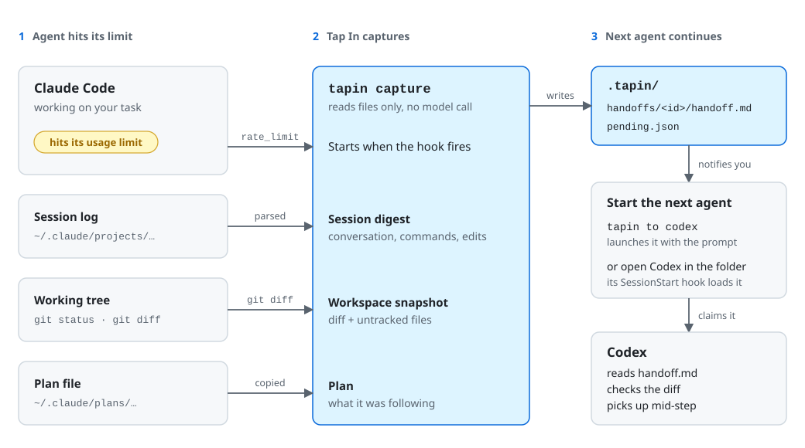
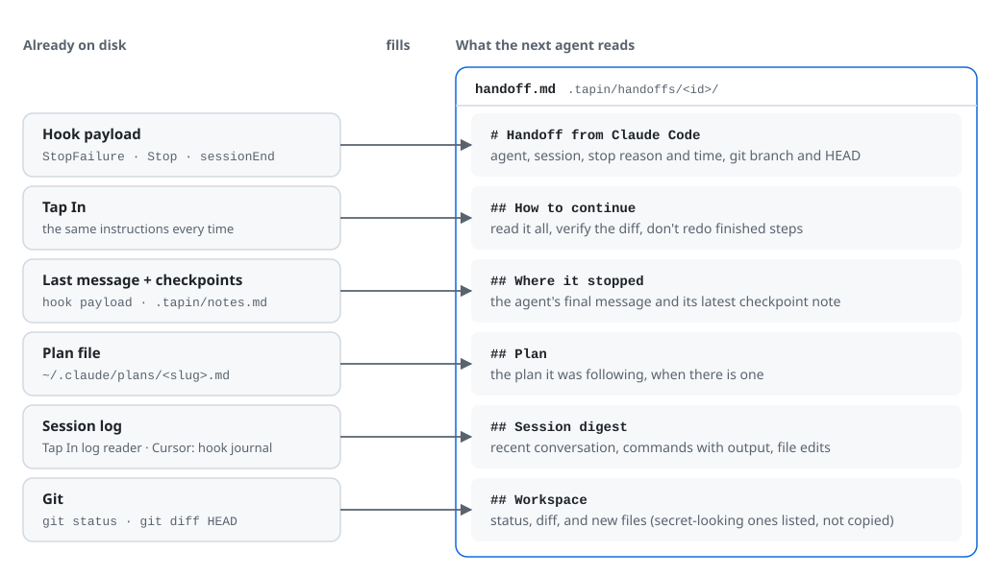
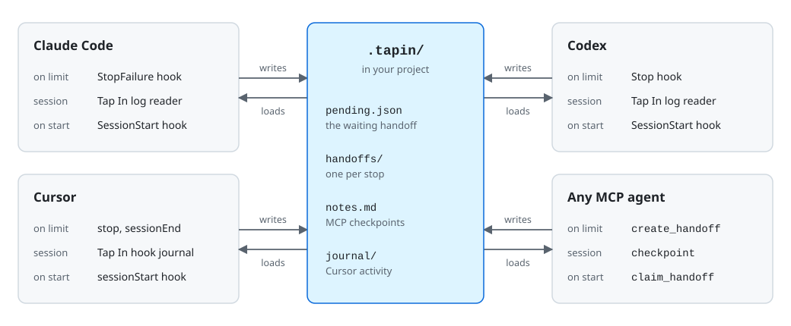

# Tap In

**Hand off unfinished AI coding work to another agent, right where it stopped.**

Tap In lets you move a task between Claude Code, Codex, Cursor and other coding agents without starting over. When an agent hits its usage limit, Tap In captures the work in the background and notifies you. The next agent you open in that folder starts with the task history, the plan, the commands that were run and the exact workspace diff.

Tap In never asks the stopped agent to summarize its own work. A rate-limited agent can't respond, so the handoff is built from what is already on disk.

## Why Tap In?

Coding agents are easy to interrupt. You hit a usage limit mid-task, want a second opinion from another model, move from a terminal agent to an IDE, or restart after a crash. Each time, the next agent has to rediscover the work:

- What was the goal?
- Which files changed, and which step was half done?
- What was already tried?
- Which commands failed?
- What was the plan?

Copying a transcript is noisy. Asking the previous agent for a summary is unreliable, and impossible once it's rate-limited. `AGENTS.md` and `CLAUDE.md` describe how the project works, not where this task stands.

Other tools can convert or summarize a session when you ask. Tap In adds what they don't: it **captures the handoff the moment the limit hits**, and **loads it into the next agent automatically** when that agent starts.

## How it works

<picture>
  <source media="(prefers-color-scheme: dark)" srcset="docs/images/flow-dark.svg">
  
</picture>

1. **An agent stops on its limit.** Its hook starts `tapin capture` in a background process, so the agent isn't held up.
2. **Tap In writes a handoff.** It reads the session log, snapshots git and copies the plan into `.tapin/handoffs/<id>/handoff.md`, marks it as waiting, and shows a macOS notification.
3. **You start the next agent.** Run `tapin to codex`, or just open Codex in the same folder. Its session-start hook finds the waiting handoff, claims it so no other session picks it up, and tells Codex to read it before doing anything else.

## What a handoff contains

<picture>
  <source media="(prefers-color-scheme: dark)" srcset="docs/images/handoff-dark.svg">
  
</picture>

A handoff mixes evidence with the previous agent's own account. The git status and diff show the real state of the repository. The last message and the conversation show what the agent believed it had done. The handoff tells the next agent to treat those statements as unverified, and to check the workspace before editing.

The workspace section (the diff plus new untracked files) and the session digest are each capped at 60,000 characters, and common secret formats are redacted before the file is written.

## Install

Tap In requires Python 3.11+, [uv](https://docs.astral.sh/uv/), and Node.js (for `npx continues`).

```sh
uv tool install --editable .
tapin install
tapin doctor
```

`tapin install` adds Tap In's hooks to Claude Code, Codex and Cursor, and registers the Tap In MCP server with each.

```sh
tapin install --agents claude,codex   # configure only some agents
tapin install --no-mcp                # hooks only
tapin install --instructions          # also add a short Tap In section to ~/.claude/CLAUDE.md and ~/.codex/AGENTS.md
```

Every config file Tap In changes is backed up first as `<file>.tapin-backup-<timestamp>`.

**Codex only runs hooks you trust.** Open Codex, run `/hooks`, and check that the Tap In `SessionStart` and `Stop` entries are active.

To remove everything: `tapin uninstall`.

## Quick start

When an agent hits its limit, you'll get a notification. In that project folder, either run:

```sh
tapin to codex
```

or open Codex there yourself. Either way, Codex starts with the handoff.

You can also hand off at any time, without waiting for a limit:

```sh
tapin to claude              # hand the newest non-Claude session here to Claude Code and launch it
tapin to cursor --from codex # choose which agent's session to hand off
tapin capture                # just write a handoff; the next agent you open picks it up
tapin status                 # show the waiting handoff and recent ones
```

`tapin status` looks like this:

```text
Workspace: /Users/you/projects/pipeline
Pending:   20260912T222249Z-codex from codex (waiting until 2026-09-13T10:22:49Z)
  20260912T222249Z-codex  usage_limit  /Users/you/projects/pipeline/.tapin/handoffs/20260912T222249Z-codex/handoff.md
```

## Common workflows

### Continue after a usage limit

Capture is automatic when:

- **Claude Code** stops with a `rate_limit` error (add others, such as `overloaded`, with `limit_errors`)
- **Codex** ends a turn on a usage-limit error
- **Cursor** stops with an error

Then run `tapin to <agent>`, or open the next agent in the folder.

### Recover after a crash, restart or full context window

These don't trigger automatic capture. `tapin to` reads the session logs directly, so it works anyway:

```sh
tapin to codex --from claude
```

### Switch agents on purpose

Hand a plan to a different model to implement, get a second agent to debug a partial change, or move from the terminal to your IDE:

```sh
tapin to cursor --from claude
```

### Hand off to a desktop app

Tap In can't start Codex Desktop or the Cursor IDE with a prompt, so for those:

```sh
tapin to codex --print
```

This writes the handoff, copies the prompt to your clipboard, and leaves the handoff waiting. Open the app in the project folder and start a new chat; its session-start hook loads the handoff.

If Cursor's terminal agent isn't installed, `tapin to cursor` opens the Cursor IDE the same way.

### Only one session picks it up

The first new session to start in the folder claims the handoff, and later sessions don't see it again. Run `tapin capture` to write a fresh one. A handoff that nobody claims stops being offered after 12 hours.

## Supported agents

<picture>
  <source media="(prefers-color-scheme: dark)" srcset="docs/images/agents-dark.svg">
  
</picture>

Agents never talk to each other directly. Each one writes to and reads from the project's `.tapin/` folder, so supporting another agent means adding one adapter rather than a bridge to every other agent.

- **Claude Code** and **Codex** (CLI and Desktop): session logs are read by [`continues`](https://github.com/yigitkonur/cli-continues).
- **Cursor**: its chats aren't readable from disk, so Tap In's own Cursor hooks record prompts, responses, file edits and shell commands as they happen.

### MCP and other agents

Any agent that supports MCP can use the Tap In MCP server, with or without an adapter:

| Tool | What it does |
|---|---|
| `handoff_status` | Shows whether a handoff is waiting in this workspace |
| `get_handoff` | Reads a handoff without claiming it |
| `claim_handoff` | Claims the waiting handoff so no other session takes it |
| `checkpoint` | Records progress, decisions and next steps; the latest one is included in the next handoff |
| `create_handoff` | Writes a handoff now, for example when an agent knows it is about to stop |

Agents without MCP can use the plain file format described in [docs/PROTOCOL.md](docs/PROTOCOL.md).

## Handoff files

```text
.tapin/
  pending.json                    the handoff waiting to be picked up
  handoffs/
    20260912T222249Z-codex/
      handoff.md                  what the next agent reads
      meta.json                   stop details: agent, session, reason, git branch and HEAD
  notes.md                        checkpoints written through MCP
  journal/                        Cursor activity recorded by hooks
```

`.tapin/` is added to `.git/info/exclude`, so it never shows up in `git status` or gets committed, and your `.gitignore` is left alone.

## Privacy and security

Tap In is local-only. Handoffs are written to your repository's `.tapin/` folder, there is no account, and session data is never sent anywhere. The only network access is `npx` downloading `continues` from npm the first time it runs.

Before writing a handoff, Tap In redacts common secret formats: Anthropic and OpenAI API keys, GitHub tokens, AWS access key IDs, Google API keys, Slack tokens and bearer headers. That is a safety net, not a guarantee.

New untracked files are copied into the handoff, except those whose names look like secrets (`.env`, `*.pem`, `*.key`, `id_rsa*`, `credentials.json`, `.netrc`, `*.tfvars` and similar), which are listed without their contents.

Tap In won't load a handoff from a `.tapin/` folder that is tracked by git, so a cloned repository can't plant instructions for your agent.

A handoff can still contain proprietary code, file paths, command output and anything said in the session. Don't share one without reading it. Handoffs are never deleted automatically; remove `.tapin/handoffs/` when you no longer need them.

## Configuration

`~/.tapin/config.toml` overrides the defaults in [`src/tapin/config.py`](src/tapin/config.py):

```toml
handoff_ttl_hours = 24                          # how long a handoff waits to be claimed (default 12)
limit_errors = ["rate_limit", "overloaded"]     # Claude Code errors that trigger capture

[agents.codex]
command = ["/Applications/ChatGPT.app/Contents/Resources/codex"]
```

| Key | Default | Controls |
|---|---|---|
| `handoff_ttl_hours` | `12` | How long an unclaimed handoff is offered to new sessions, capped at 7 days |
| `limit_errors` | `["rate_limit"]` | Claude Code `StopFailure` errors that trigger capture. Re-run `tapin install` after changing it, since it also sets the hook matcher |
| `limit_message_pattern` | usage/rate limit, quota, 429 | Which Cursor error messages count as a limit |
| `diff_max_chars` / `digest_max_chars` | `60000` | Size caps for the workspace section (diff plus new untracked files) and the session digest |
| `brief_max_chars` | `3500` | Size of the note injected when a session starts |
| `agents.<name>.command` | `claude`, `codex`, `cursor agent` | How `tapin to` launches each agent |
| `readers.<name>` | `continues`, or `journal` for Cursor | How each agent's session is read |
| `continues.command` / `continues.timeout_seconds` | `npx -y continues@4.1.1`, `180` | The command that reads Claude Code and Codex session logs, and how many seconds to wait for it |

## Limitations

- **Nothing is verified automatically.** The handoff tells the next agent to check the workspace, but Tap In itself doesn't compare the repository against the captured state.
- **Reasoning doesn't transfer.** Claude Code stores little of its thinking and Codex encrypts its reasoning; what transfers is what the agent wrote, ran and edited.
- **Codex limit detection is unconfirmed.** It hasn't been tested against a real Codex limit yet. `tapin to <agent> --from codex` works regardless.
- **Cursor captures on any agent error,** not only usage limits. Its `stop` hook doesn't say why a turn failed. When the `sessionEnd` that follows carries a usage-limit message, the handoff's reason is updated to `rate_limit`.
- **One waiting handoff per workspace.** A new capture replaces the one waiting to be claimed; older handoffs stay in `.tapin/handoffs/`.
- **Built and tested on macOS.** Notifications, clipboard copy and the default Codex path are macOS-specific. File locking uses `fcntl`, so Windows isn't supported yet.

## Design principles

- **Evidence over narration.** The git diff and the commands that ran are more reliable than a summary.
- **No model call at capture time.** The agent that stopped can't help, so capture reads files only.
- **Check before editing.** The next agent reconciles the workspace with the handoff before changing anything.
- **Portable.** Handoffs are plain Markdown and JSON that any agent, or person, can read.
- **Local-first.** Your code and session history stay on your machine.
- **Useful without a failure.** `tapin to` works whenever you want to switch, not only after a limit.

## Development

```sh
uv run pytest
python3 docs/images/make_diagrams.py   # regenerate the diagrams
```

## Contributing

Contributions are especially useful for:

- Adapters for more agents (Gemini CLI, GitHub Copilot CLI, OpenCode and others)
- Real Codex usage-limit error samples, to confirm detection
- A `verify` command that compares the workspace against a handoff
- Linux and Windows support
- Tests across real repositories and agent workflows
